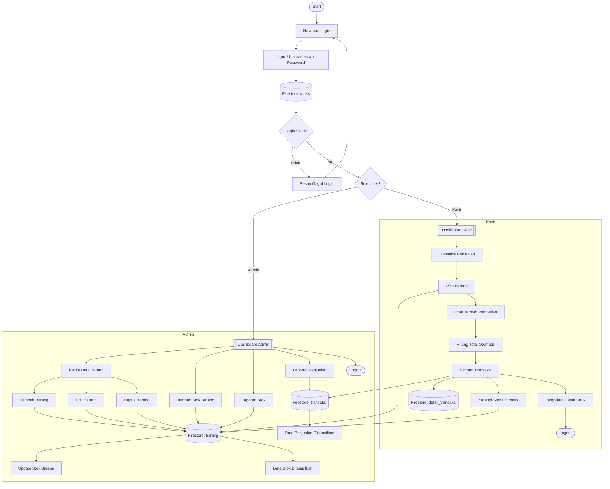

#  POS Kantin Sekolah

Web-based School Canteen Point of Sale System with multi-user authentication, real-time inventory management, and sales reporting.

---

##  Tech Stack

| Technology | Purpose |
|---|---|
| ReactJS + Vite | Frontend framework |
| TailwindCSS | Styling |
| Firebase Authentication | User login |
| Firebase Firestore | Real-time database |
| React Router DOM | Page navigation |

---

##  Features

###  Admin
- Login with role-based access
- Create, Read, Update, Delete (CRUD) product data
- Manage product stock
- View stock report (highlights low stock < 5)
- View sales report with date filter
- Add & manage cashier accounts

###  Kasir (Cashier)
- Login with role-based access
- Browse products in grid view
- Add products to cart
- Auto-calculate total price
- Input payment & auto-calculate change
- Auto-reduce stock on transaction
- Display digital receipt

---

##  Project Structure

```
src/
├── pages/
│   ├── Login.jsx
│   ├── DashboardAdmin.jsx
│   ├── DashboardKasir.jsx
│   ├── DataBarang.jsx
│   ├── Transaksi.jsx
│   ├── LaporanStok.jsx
│   └── LaporanPenjualan.jsx
├── components/
│   ├── Navbar.jsx
│   ├── Sidebar.jsx
│   ├── ModalBarang.jsx
│   ├── KeranjangItem.jsx
│   └── StrukPrint.jsx
├── context/
│   └── AuthContext.jsx
├── hooks/
│   ├── useBarang.js
│   └── useTransaksi.js
├── firebase/
│   ├── config.js
│   ├── auth.js
│   └── firestore.js
└── utils/
    ├── formatRupiah.js
    └── formatTanggal.js
```

---

##  Firestore Collections

```
users            → uid, email, nama, role
barang           → id, nama, harga, stok, kategori, gambarUrl
transaksi        → id, kasirId, kasirNama, total, bayar, kembalian, createdAt
detail_transaksi → id, transaksiId, barangId, namaBarang, harga, jumlah, subtotal
```

---

##  Installation & Setup

### 1. Clone the repository
```bash
git clone https://github.com/username/pos-kantin.git
cd pos-kantin
```

### 2. Install dependencies
```bash
npm install
```

### 3. Setup environment variables

Create a `.env` file in the root directory:
```env
VITE_FIREBASE_API_KEY=your_api_key
VITE_FIREBASE_AUTH_DOMAIN=your_project.firebaseapp.com
VITE_FIREBASE_PROJECT_ID=your_project_id
VITE_FIREBASE_STORAGE_BUCKET=your_project.appspot.com
VITE_FIREBASE_MESSAGING_SENDER_ID=your_sender_id
VITE_FIREBASE_APP_ID=your_app_id
```

> Get these values from Firebase Console → Project Settings → Your apps → Web app.

### 4. Firebase Setup

1. Enable **Email/Password** sign-in at Firebase Console → Authentication → Sign-in method
2. Create Firestore database in **test mode**
3. Create a user at Authentication → Users → Add user
4. Add the user document to Firestore `users` collection with the same UID

### 5. Run the app
```bash
npm run dev
```

Open [http://localhost:5173](http://localhost:5173) in your browser.

---

##  Default Accounts

| Role | Email | Password |
|---|---|---|
| Admin | admin@kantin.com | admin123 |

> Admin account must be created manually in Firebase Authentication. Cashier accounts can be added directly by the Admin through the app.

---

## 📊 System Flowchart



---

## 📝 License

This project is made for educational purposes.
